# Temple Attendance — Flowcharts & Module Diagrams

Visual reference for **every role, every login, and every functionality**.
All diagrams are [Mermaid](https://mermaid.js.org) — they render on GitHub and in most
Markdown viewers (VS Code: install "Markdown Preview Mermaid Support").

## Contents
1. [System & hierarchy](#1-system--hierarchy)
2. [Roles & scope](#2-roles--scope)
3. [Login flows (all 6 logins)](#3-login-flows)
4. [Routing & guards](#4-routing--guards)
5. [Role → module access](#5-role--module-access)
6. [Account provisioning](#6-account-provisioning)
7. [Attendance — mark, lock, correction](#7-attendance--mark-lock-correction)
8. [QR scan attendance](#8-qr-scan-attendance)
9. [Student Check Register (SCR)](#9-student-check-register-scr)
10. [Notifications + FCM push](#10-notifications--fcm-push)
11. [P.A. / transfers](#11-pa--transfers)
12. [Events](#12-events)
13. [Shibir](#13-shibir)
14. [Import people (CSV)](#14-import-people-csv)
15. [Reports & export](#15-reports--export)
16. [Parent & student portals](#16-parent--student-portals)
17. [Firestore data model](#17-firestore-data-model)

---

## 1. System & hierarchy

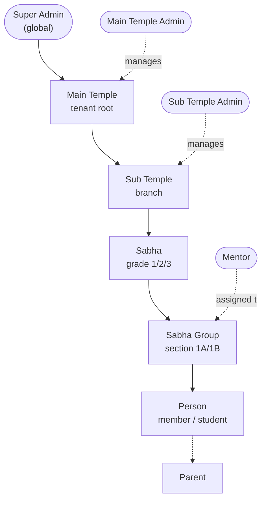

Every record stores denormalized ancestor IDs (`templeId / subTempleId / sabhaId /
sabhaGroupId`) so the tree stays shallow and queries/rules stay cheap.

---

## 2. Roles & scope

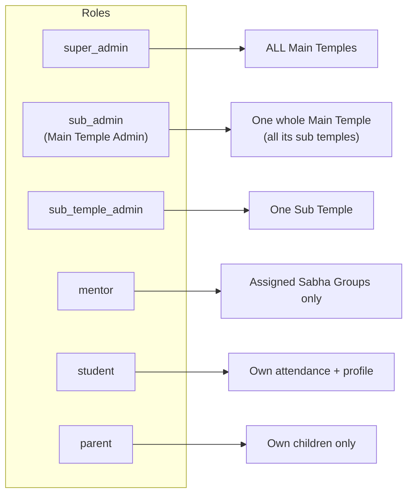

| Role | value | Signs in with | Scope |
|---|---|---|---|
| Super Admin | `super_admin` | email + password (seeded) | all temples |
| Main Temple Admin | `sub_admin` | email + password | one Main Temple |
| Sub Temple Admin | `sub_temple_admin` | email + password | one Sub Temple |
| Mentor | `mentor` | email + password | assigned Sabha Groups |
| Student | `student` | Unique ID + password | own data |
| Parent | `parent` | mobile + password | own children |

---

## 3. Login flows

### 3.1 Which login screen
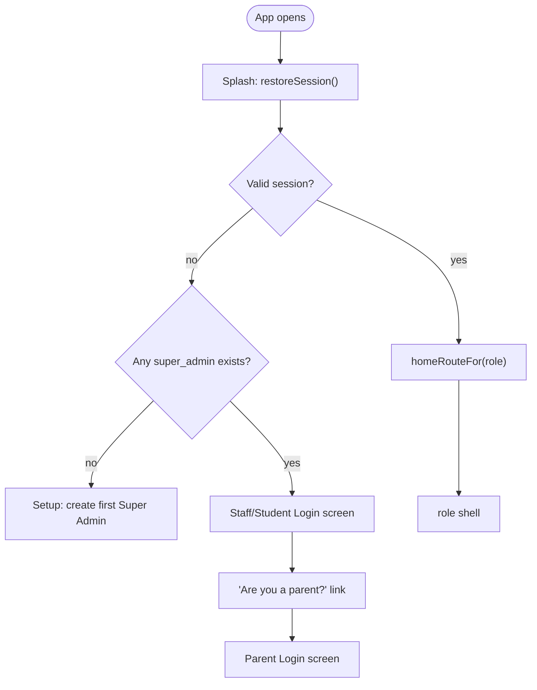

### 3.2 Staff / Admin / Mentor (email + password)
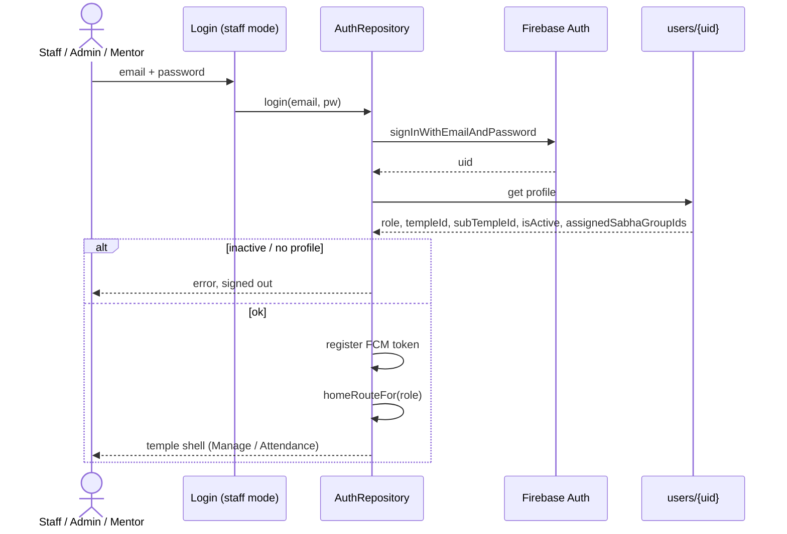

### 3.3 Student (Unique ID + password)
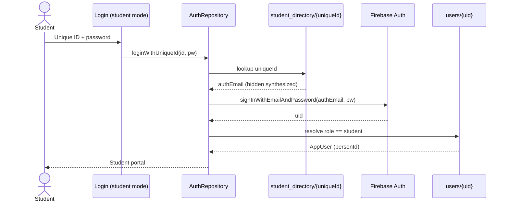

### 3.4 Parent (mobile + password)
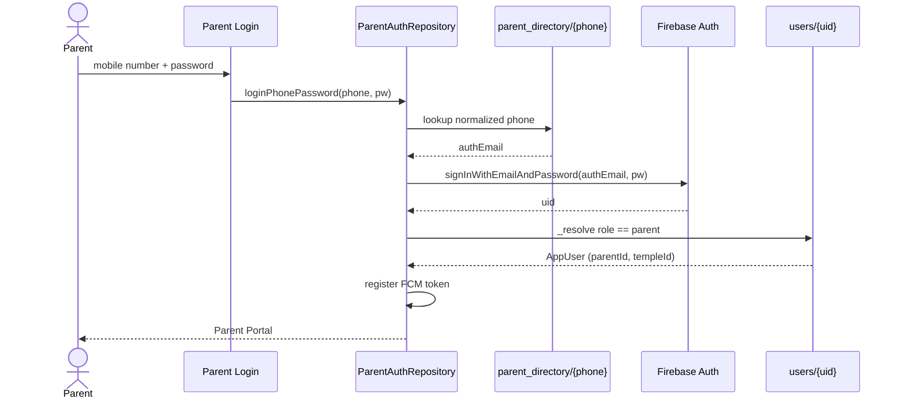

### 3.5 First-run Super Admin
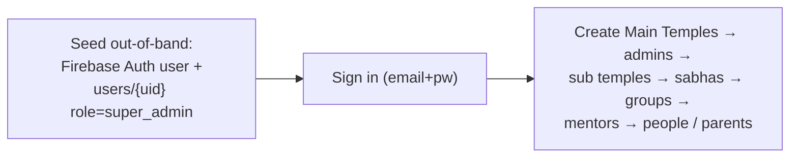

---

## 4. Routing & guards

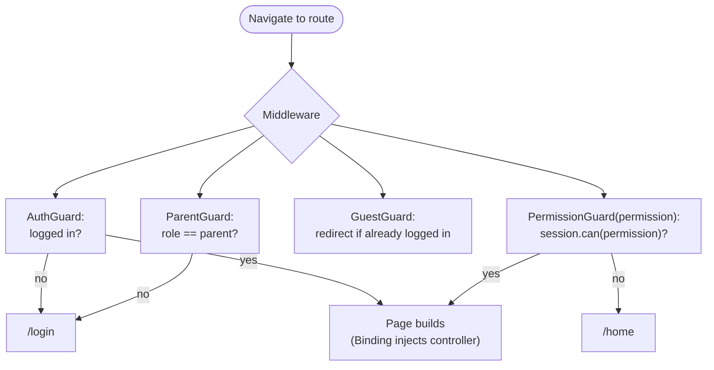

`homeRouteFor(role)`: parent → `/parent/home`, student → `/student/home`, everyone else → `/home`.

---

## 5. Role → module access

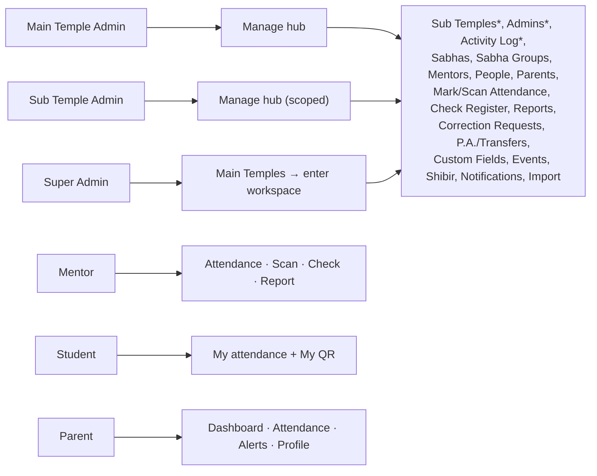
`*` = Main-Temple-admin / Super-admin only (Sub Temple Admin does not see Sub Temples, Admins, Activity Log).

### Permission matrix
| Capability (Permission) | super | sub_admin | sub_temple_admin | mentor | student/parent |
|---|:--:|:--:|:--:|:--:|:--:|
| manageTemples | ✅ | — | — | — | — |
| manageAdmins / manageSubTemples | ✅ | ✅ | — | — | — |
| manageSabhas / manageMentors / managePeople / manageParents | ✅ | ✅ | ✅ | people only | — |
| markAttendance / editAttendance | ✅ | ✅ | ✅ | ✅ | — |
| manageSchedule (lock) / reviewAttendanceRequests | ✅ | ✅ | ✅ | — | — |
| runChecker | ✅ | ✅ | ✅ | ✅ | — |
| managePA / transferPeople | ✅ | ✅ | ✅ | — | — |
| manageEvents / manageShibir / manageFieldConfig | ✅ | ✅ | ✅ | — | — |
| sendParentNotifications | ✅ | ✅ | ✅ | ✅ | — |
| generateReports / importData | ✅ | ✅ | ✅ | reports | — |
| viewActivityLog / viewAnalytics | ✅ | ✅ | — | — | — |
| viewOwnAttendance | — | — | — | — | ✅ |

---

## 6. Account provisioning

How an admin creates logins without being signed out (secondary Firebase app).

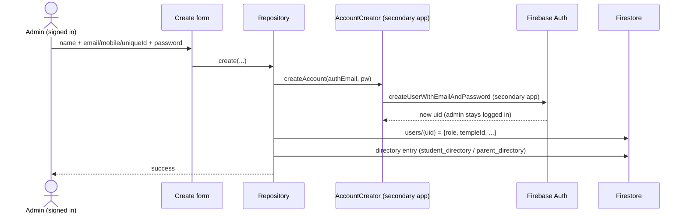
Applies to: **Admins**, **Mentors**, **People** (optional login), **Parents**.

---

## 7. Attendance — mark, lock, correction

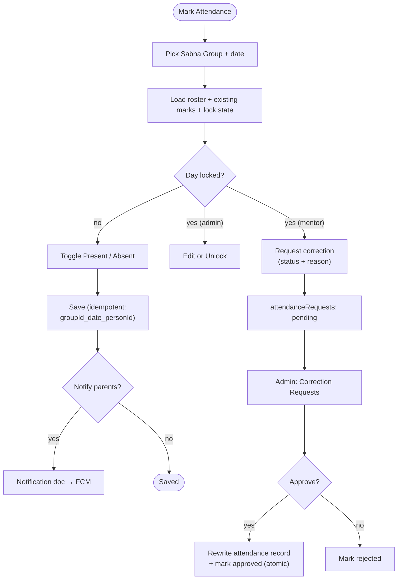

Admins lock/unlock via the lock icon; the lock is also **enforced in Firestore rules**
(`dayLocked()` blocks mentor writes; admins bypass).

---

## 8. QR scan attendance

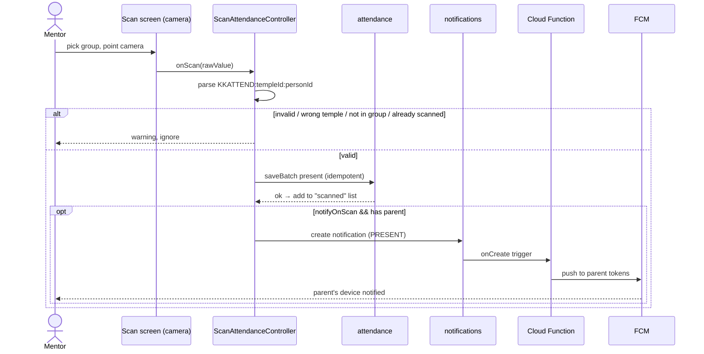

Each student carries a QR (`KKATTEND:<templeId>:<personId>`) shown from **People → Show QR**
or the **student's own portal**.

---

## 9. Student Check Register (SCR)

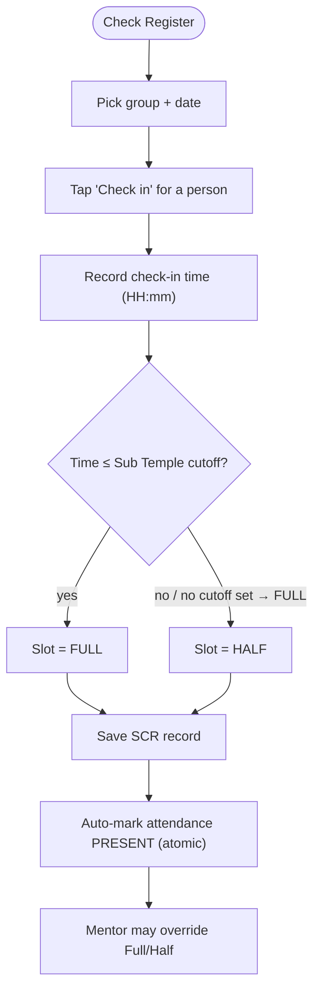

---

## 10. Notifications + FCM push

### 10.1 Compose (in-app)
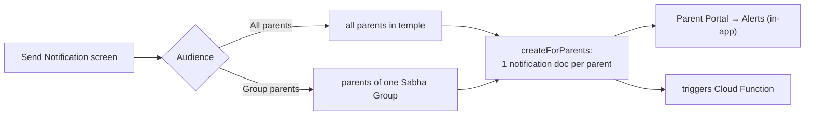

### 10.2 Push delivery (server)
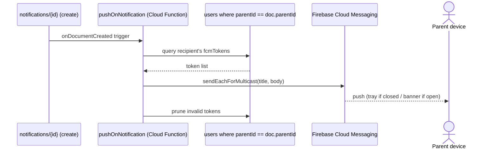
Tokens are saved by `PushService.registerFor(uid)` on every login / session restore.
Requires the function deployed (Blaze). In-app Alerts work without it.

---

## 11. P.A. / transfers

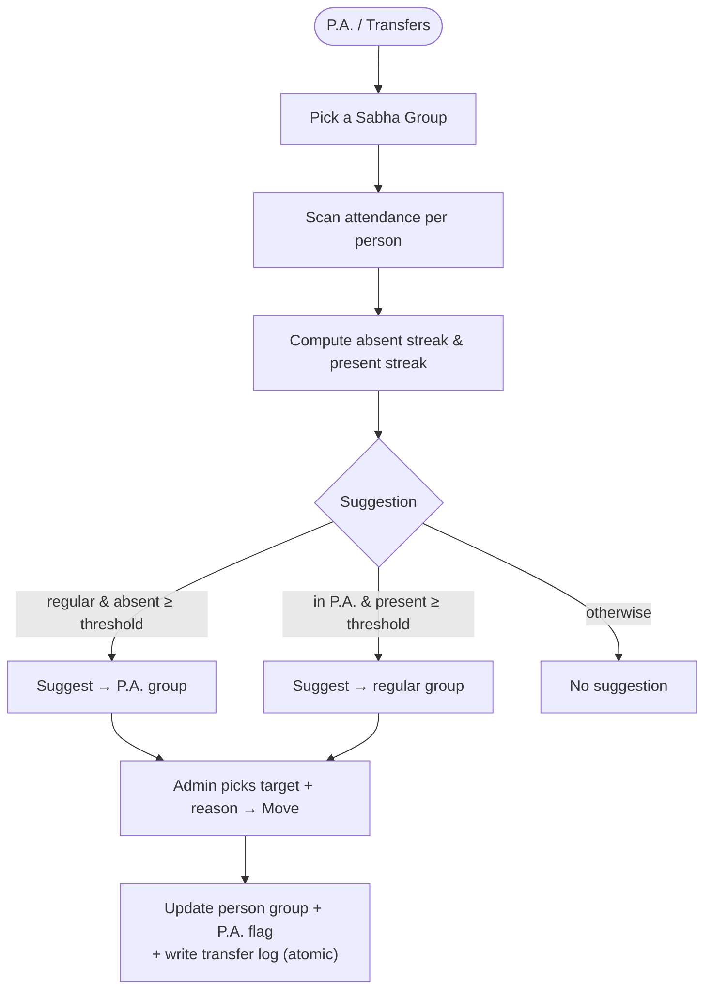
Thresholds are configured per Sub Temple (`paAbsentThreshold` / `paPromoteThreshold`).

---

## 12. Events

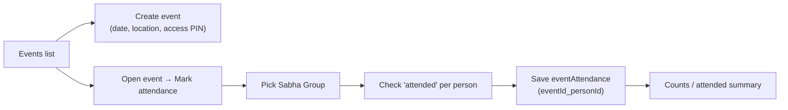

---

## 13. Shibir

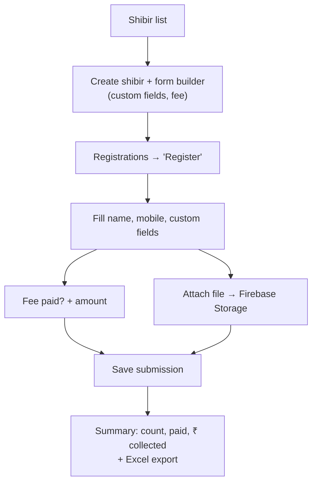

---

## 14. Import people (CSV)

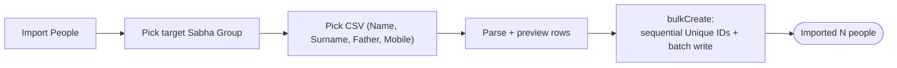

---

## 15. Reports & export

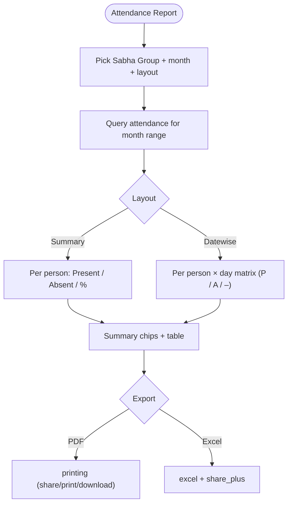

---

## 16. Parent & student portals

### Parent portal
```mermaid
flowchart LR
  PH["Parent Home"] --> D["Dashboard:<br/>children + avg attendance"]
  PH --> A["Attendance:<br/>calendar + trend + history (per child)"]
  PH --> AL["Alerts:<br/>notifications (bell)"]
  PH --> PR["Profile:<br/>edit, change password, sign out"]
  D --> CD["Child details (read-only)"]
```
Strictly isolated: queries only `people where parentId == own` and that child's attendance.

### Student portal
```mermaid
flowchart LR
  SH["Student Home"] --> own["Own attendance (calendar/history)"]
  SH --> qr["My QR (present to mentor)"]
  SH --> out["Sign out"]
```

---

## 17. Firestore data model

```mermaid
erDiagram
  USERS ||--o| PEOPLE : "personId (student)"
  USERS ||--o| PARENTS : "parentId (parent)"
  MAIN_TEMPLE ||--o{ SUB_TEMPLE : has
  SUB_TEMPLE ||--o{ SABHA : has
  SABHA ||--o{ SABHA_GROUP : has
  SABHA_GROUP ||--o{ PERSON : has
  PARENT ||--o{ PERSON : "children (parentId)"
  SABHA_GROUP ||--o{ ATTENDANCE : "per day"
  PERSON ||--o{ ATTENDANCE : marked
  PERSON ||--o{ SCR_RECORD : "check-in"
  PERSON ||--o{ TRANSFER : "moved"
  SHIBIR ||--o{ SHIBIR_SUBMISSION : has

  USERS {
    string uid PK
    string role
    string templeId
    string subTempleId
    string personId
    string parentId
    list assignedSabhaGroupIds
    list fcmTokens
    bool isActive
  }
  PERSON {
    string personId PK
    string templeId
    string sabhaGroupId
    string uniqueId
    string parentId
    map fields
  }
  ATTENDANCE {
    string id PK "groupId_date_personId"
    string personId
    string dateKey
    string status
  }
```

Flat lookup collections (read before sign-in): `parent_directory/{phone}`,
`student_directory/{uniqueId}`. Everything else lives under `mainTemples/{templeId}/…`.
